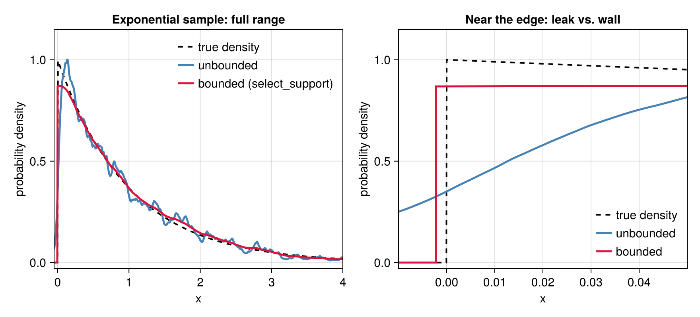

```@meta
CurrentModule = PenalizedDensity
```

# Tutorial

This walkthrough fits a bimodal distribution, chooses the smoothing scale, and tests
candidate models against the data.

## A worked example

Consider a mixture of two Gaussians with equal weight, a narrow one (``\sigma=0.4``) centered at ``x=-2`` and a broad one (``\sigma=1.2``) at ``x=3``. First let's draw some samples from this distribution:

```@example tutorial
using Random

Random.seed!(42)
comps = [(w=0.5, μ=-2.0, σ=0.4), (w=0.5, μ=3.0, σ=1.2)]
truepdf(x) = sum(c.w * exp(-((x - c.μ) / c.σ)^2 / 2) / (c.σ * sqrt(2π)) for c in comps)

N = 2000
xs = [rand() < comps[1].w ? comps[1].μ + comps[1].σ * randn() :
                            comps[2].μ + comps[2].σ * randn() for _ in 1:N]
nothing # hide
```

To construct an estimate of the density from the points `xs`, we first select a *smoothing length scale* and then construct the density:

```@example tutorial
using PenalizedDensity

κ = select_kappa_kl(xs)                 # recommended scale (KL cross-validation)
d = DensityEstimate(xs, κ)              # fit at the recommended scale
nothing # hide
```

`κ` determines the amount of smoothing: the amplitude of the density estimate will decay over a length scale `1/κ`.
`d` is a callable density: `d(x)` returns the estimated density at a single point `x`.
Let's plot this estimate (constructed using the recommended [`select_kappa_kl`](@ref) to compute the scale),
along with the result for a different ``\kappa`` estimator, the half-entropy as computed by
[`kappa_interval`](@ref): 

```julia
using CairoMakie                              # for plotting
ki = kappa_interval(x)                        # alternative estimator for scale
d_half = DensityEstimate(x, ki.κ)             # construct the alternative estimate
g = range(-4.5, 7.5; length = 800)
lines(g, truepdf.(g); linestyle = :dash, label = "true density")
lines!(g, d.(g); label = "κ = $(round(κ, digits=1)) (KL, recommended)")
lines!(g, d_half.(g); label = "κ = $(round(ki.κ, digits=1)) (half-entropy)")
axislegend()
```


Both scales recover both peaks: the recommended KL ``\kappa`` is visibly
smoother, the half-entropy ``\kappa`` sharper, but each resolves the narrow and
the broad component at once. Note that **`κ` is a resolution scale, not a
component width.** Its reciprocal ``1/\kappa`` is smaller than either
component's ``\sigma``, so the estimator resolves features of any larger width,
which is set by the underlying distribution and the data obtained by sampling
from it.

## Choosing the smoothing scale

PenalizedDensity offers four automatic selectors. They split into two families: two that
target *estimation error* (recommended for smooth data) and two that resolve *information*
in the data (the right choice for heavily tied or discrete data). The **recommended
default** is [`select_kappa_kl`](@ref), which minimizes a likelihood (Kullback–Leibler)
cross-validation score:

```@example tutorial
κ_kl = select_kappa_kl(xs)       # recommended: error-optimal, likelihood cross-validation
```

Its score is the leave-one-out log-likelihood ``-\tfrac1N\sum_i \ln \hat
Q_{-i}(x_i)``, where ``\hat Q_{-i}(x_i)`` is an estimate at the point ``x_i``
formed from all points *except* ``x_i`` itself. This score is an estimate of
``\mathrm{KL}(Q \,\|\, \hat Q_\kappa)`` up to a constant; it is the criterion
native to the estimator, whose action is itself a log-likelihood. A close
relative, [`select_kappa_cv`](@ref), instead minimizes a least-squares (MISE)
cross-validation score:

```@example tutorial
κ_cv = select_kappa_cv(xs)       # least-squares cross-validation (MISE)
```

Both are evaluated analytically — each leave-one-out density comes from a first-order
expansion of the fit, so no point-by-point refitting is needed — and to leading order they
select the same ``\kappa \propto N^{1/5}``. Across a range of test densities `select_kappa_kl`
tracks the error-optimal scale most closely (see `benchmarks/`) and is the cheaper of the
two, which is why it is the default. Both assume a *continuous* underlying density; on
heavily tied or coarsely rounded data their scores are unbounded as ``\kappa\to\infty``, and
the two information-resolving selectors below are the better choice.

The first information-resolving selector, [`kappa_interval`](@ref), returns a principled
scale with a plausible range. Its basis is that the reduced action ``g(\kappa) = S(\kappa) + W\ln\kappa``
(``W`` = total count) rises monotonically between two *exact* limits — ``W/2`` as
``\kappa\to0`` (all points merge into one lump) and ``W/2 + W H`` as ``\kappa\to\infty``
(the ``N`` points become isolated), where ``H`` is the Shannon entropy of the data. The
normalized quantity ``h(\kappa)\in[0,1]`` is thus the *fraction of the data's entropy that
``\kappa`` resolves*, and its half-point is the returned scale:

```@example tutorial
ki = kappa_interval(xs)          # (; κ, lo, hi): the half-entropy scale and a band
(κ = round(ki.κ, digits=1), lo = round(ki.lo, digits=1), hi = round(ki.hi, digits=1))
```

The picture below makes this concrete. The reduced action (red) climbs from its
``\kappa\to0`` floor ``W/2`` (nothing resolved, ``h=0``) to its ``\kappa\to\infty`` ceiling
``W/2 + W H`` (every point resolved, ``h=1``); both dashed limits are exact and depend only
on the counts. The returned scale is where the curve is halfway up — half the entropy
resolved — and the shaded band is the plausible range:


The second information-resolving selector, [`select_kappa_ms`](@ref), returns a related but
distinct scale: the point of *minimum sensitivity*, where `|dS/d ln κ|` is smallest. Its
derivative is computed analytically, so the result is free of the noise that
finite-differencing the action curve would introduce.

```@example tutorial
κ_ms = select_kappa_ms(xs)       # minimum-sensitivity scale
```

`select_kappa_ms` and `kappa_interval` generally select different scales, but both resolve
*information* in the data rather than minimizing error, and on smooth densities they tend to
over-resolve — which is why the cross-validation selectors are recommended by default. Their
value is on heavily tied or discrete data, where they stay bounded and the cross-validation
scores do not.

## Letting the scale vary across the data

Every selector above returns one ``\kappa`` for the whole line, and a single scale has to
compromise: fine enough to resolve the peaks, coarse enough to stay quiet in the tails.
On a smooth density that compromise costs little. But when the density is *irregular* — a
divergent or discontinuous edge, a kink, a heavy tail — a constant ``\kappa`` is limited not
by noise but by the density's own shape, and no choice of it is good everywhere.

[`select_kappa_adaptive`](@ref) lifts the compromise by letting the scale follow the density,
``\kappa(x)`` large where the density is high, and small where it is low.
In other words, the smoothing length scale will grow with the size of the expected gap between adjacent sampled points.

As an example, take a ``\chi^2_1`` sample, whose density diverges as ``x^{-1/2}`` at the origin:

```@example adaptive
using PenalizedDensity, Random, Statistics

Random.seed!(7)
z = randn(4000) .^ 2                  # χ²₁: the density diverges at x = 0

κ_const = select_kappa_kl(z)          # one scale everywhere
κ_var = select_kappa_adaptive(z)      # a scale that follows the density
```

The adaptive selector returns an [`AdaptiveScale`](@ref) — a callable ``\kappa(x)`` — which
[`DensityEstimate`](@ref) takes exactly where a number would go:

```@example adaptive
d_const = DensityEstimate(z, κ_const)
d_var = DensityEstimate(z, κ_var)
```

Below, the left panel shows true underlying density (dashed) and the two estimates `d_const` and `d_var`;
the right panel shows how `κ_const` and `κ_var` depend on position.


Neither density estimate can track much below ``x \approx 10^{-3}`` (typically, fewer than one hundred points land within `[0, 1e-3]`),
but the adaptive one tracks the power law to about tenfold-smaller `x` than the one with constant `κ`.
The payoff is measurable on held-out data — the mean
log-likelihood of a fresh sample, whose gap is the reduction in KL divergence, in nats per
sample:

```@example adaptive
ztest = randn(4000) .^ 2
loglik(d) = mean(log.(d.(ztest)))

(constant = round(loglik(d_const); digits = 3),
 varying = round(loglik(d_var); digits = 3),
 gain = round(loglik(d_var) - loglik(d_const); digits = 3))
```

Concretely, how is ``\kappa(x)`` determined? The rule is a *plug-in* of the variable-bandwidth kind; Abramson's square-root law,
[*Ann. Statist.* **10**, 1217 (1982)](https://doi.org/10.1214/aos/1176345986), is the
``\alpha = 1/2`` member. A pilot fit ``\hat p`` at the constant scale supplies the shape, and
the scale is drawn from the family ``\kappa(x) = c\,(\hat p(x)/\bar g)^{\alpha}`` (``\bar g``
the geometric mean of ``\hat p`` over the sample). Both the overall scale ``c`` and the
exponent ``\alpha`` — how strongly ``\kappa`` follows the density — are chosen by the *same*
leave-one-out KL score that [`select_kappa_kl`](@ref) minimizes, generalized to a varying
scale and still evaluated in closed form and in ``O(N)``:

```@example adaptive
(c = round(κ_var.c; digits = 1), α = κ_var.α)   # the selected scale and exponent
```

Crucially, the constant scale competes in that same comparison: it's the ``\alpha = 0`` member
of the family, ``\kappa(x) = c``, so **adaptivity is used only when it wins**. When it does not, the selector
says so by returning a plain number rather than an `AdaptiveScale` — as on uniform data,
where ``\kappa \propto \hat p^\alpha`` has no contrast to exploit:

```@example adaptive
select_kappa_adaptive(rand(2000)) isa Real   # nothing to buy: the constant scale wins
```

## Fitting a hard edge

A varying scale sharpens resolution near a feature, but it still fits an amplitude built from
exponential tails, which extend over all of ``\mathbb{R}``. When the true density has a genuine
edge — zero on one side, nonzero on the other — no choice of ``\kappa(x)`` reproduces that
exactly: the fit always leaks a sliver of mass across the line. [`DensityEstimate`](@ref)'s
`support` keyword fixes this directly, by imposing a natural (Neumann) boundary condition at a
finite endpoint rather than approximating it with decay; [`select_support`](@ref) chooses that
endpoint from the data, the same way the other selectors choose ``\kappa``.

As an example, take a sample from the standard exponential distribution, whose density jumps
from `0` to `1` at ``x=0``:

```@example bounded
using PenalizedDensity, Random, Statistics

Random.seed!(11)
N = 1500
x = -log.(1 .- rand(N))                 # exponential(1): a jump edge at x = 0

κ_const = select_kappa_kl(x)
d_unbounded = DensityEstimate(x, κ_const)

(κ = round(κ_const; digits=1), leaked_mass = round(cdf(d_unbounded, 0.0); digits=4))
```

`leaked_mass` is [`cdf`](@ref)`(d_unbounded, 0.0)`, the fitted probability of landing on the
wrong side of the true edge: about one percent of the fit's mass sits below `x = 0`, where the
true density is exactly zero. [`select_support`](@ref) finds a left wall that removes this
directly:

```@example bounded
r = select_support(x)
d_bounded = DensityEstimate(x, r.κ; support = r.support)

(wall = round(r.support[1]; digits=5), κ = round(r.κ; digits=2), cdf_at_wall = cdf(d_bounded, r.support[1]))
```

`cdf_at_wall` is exactly `0`, not merely small: mass cannot cross a natural boundary. Note also
that the selected scale drops to about a fifth of `κ_const` — the unbounded fit was
over-sharpening to fight the leak, and no longer needs to once the wall is doing that job (the search
re-optimizes `κ` at every boundary candidate; see
[`select_support`](@ref)'s docstring). The wall itself sits close to the data:

```@example bounded
spacing = PenalizedDensity._edge_spacing(sort(x), :left)   # mean spacing of the 10 points nearest the edge
gap = minimum(x) - r.support[1]
round(gap / spacing; digits=2)
```

which is the search's hard floor: **`select_support` never places a wall closer than five mean
edge-spacings to the data, because a boundary any closer reflects the nearest interior points
back onto themselves and inflates their leave-one-out likelihood on any sample, edge or not, not
only this one.** On a genuine hard edge this floor is usually where the search lands, as it does
here; a smooth sample has no edge to find in the first place, and the search says so plainly by
returning the unbounded candidate:

```@example bounded
xg = randn(1500)
rg = select_support(xg)

(support = rg.support, κ_matches_plain_selection = rg.κ === select_kappa_kl(xg))
```

`support == (-Inf, Inf)` and the returned `κ` is not merely close to `select_kappa_kl(xg)` but
*identical* to it — the unbounded candidate always competes, and here it wins outright.

To combine a boundary with a varying scale, pass the chosen
`support` on to [`select_kappa_adaptive`](@ref) so that its own search runs on the bounded domain:

```@example bounded
κ_composed = select_kappa_adaptive(x; support = r.support)
d_composed = DensityEstimate(x, κ_composed; support = r.support)

(α = κ_composed.α, c = round(κ_composed.c; digits=2))
```

We can test whether this fit is a genuine improvement by generating independent data from
the same underlying distribution:

```@example bounded
xtest = -log.(1 .- rand(N))
loglik(d) = mean(log.(d.(xtest)))

(unbounded = round(loglik(d_unbounded); digits=3),
 bounded = round(loglik(d_bounded); digits=3),
 bounded_and_adaptive = round(loglik(d_composed); digits=3))
```

The wall accounts for essentially all of the gain here: once it has absorbed the edge's leak,
little irregularity is left in an otherwise-exponential interior, and
the two scores agree to within the noise of a fresh `N`-point sample. The picture below makes
the boundary's effect on the fit itself concrete — the unbounded estimate (blue) trailing off
below `x = 0` where the true density (dashed) is zero, against the bounded estimate (crimson),
pinned flat at the wall:



## Goodness of fit

Because the estimate is a genuine likelihood fit, you can ask how well a *specific* model
distribution describes the data. Using the fit `d` from above, [`chisq`](@ref) is a
robust, binning-free ``\chi^2`` (the squared Hellinger distance between a trial density and
the data):

```@example tutorial
wrong(x) = exp(-((x - 0.5) / 2.5)^2 / 2) / (2.5 * sqrt(2π))   # a single broad Gaussian

(correct = round(chisq(d, truepdf); digits = 1),
 incorrect = round(chisq(d, wrong); digits = 1))
```

The true mixture yields a far smaller ``\chi^2`` than the mismatched single Gaussian.
[`pvalue`](@ref) turns the statistic into a significance under the reference distribution of
``\chi^2`` — the finite-``N`` generalized chi-squared law, computed by default:

```@example tutorial
(p_correct = round(pvalue(d, truepdf); digits = 3),
 p_incorrect = round(pvalue(d, wrong); digits = 6))
```

The single Gaussian is decisively rejected; the true mixture is not. [`chisq_pdf`](@ref) /
[`chisq_ccdf`](@ref) give the reference density and upper-tail probability, and
[`expected_chisq`](@ref) its mean. To test many trial densities against one fit, build the
reference once with [`chisq_reference`](@ref) and reuse it:

```@example tutorial
ref = chisq_reference(d)
(mean = round(expected_chisq(ref); digits = 2),
 p_correct = round(pvalue(ref, chisq(d, truepdf)); digits = 3))
```

The reference law is exact for the Gaussian fluctuation field of the Laplace approximation
about the fit, and `method = :exact` evaluates it at finite ``N``, taking no large-``N``
limit. See [`chisq_reference`](@ref) for context and more information.

The exact law is a per-call integral (Imhof inversion): accurate, but tens of milliseconds
apiece. Passing `method = :largeN` selects instead the closed-form inverse-Gaussian (Wald)
shape of the original paper's large-``N`` limit, parameterized by the mean
[`expected_chisq`](@ref); it costs microseconds, so a large batch of trial densities against
one fit is far cheaper. Anchored to that mean, it tracks the exact tail closely rather
than overstating it:

```@example tutorial
(exact = round(pvalue(d, truepdf); digits = 3),
 largeN = round(pvalue(d, truepdf; method = :largeN); digits = 3))
```

All of this — the exact law and the `:largeN` shape alike — works unchanged on a fit at a
varying scale or a finite `support`: both are read from the same reference the fit assembles,
in the same ``O(N)``.

## Entropy and negentropy

Because the fit is a smooth density, its information content follows in closed form.
[`entropy`](@ref) is a plug-in estimate of the differential entropy ``H(Q) = -\int Q \ln Q``,
and [`negentropy`](@ref) is the entropy deficit relative to the Gaussian of the same mean and
variance — a scale-free measure of how *non-Gaussian* the density is, zero for a Gaussian and
positive otherwise:

```@example tutorial
(H = round(entropy(d); digits = 3), J = round(negentropy(d); digits = 3))
```

The bimodal fit is strongly non-Gaussian, so its negentropy is well above zero. `negentropy`
is invariant to shifting and rescaling the data (with the matching ``\kappa \mapsto \kappa/|a|``),
so it measures shape alone.

Both quantities also take a second argument of *held-out* points — data that did not enter
the fit — in which case ``\ln \hat Q`` is scored there and the Gaussian reference uses the
held-out sample's own variance:

```@example tutorial
xeval = [rand() < comps[1].w ? comps[1].μ + comps[1].σ * randn() :
                               comps[2].μ + comps[2].σ * randn() for _ in 1:1000]
(H = round(entropy(d, xeval); digits = 3), J = round(negentropy(d, xeval); digits = 3))
```

The held-out negentropy is close to the in-sample value here because the fit generalizes
well. Scoring on points that did not build the fit is what makes the held-out form
informative: unlike the in-sample value, it is not inflated by concentrating the density
onto the fit sample, the same reason [`select_kappa_cv`](@ref) cross-validates.

The log density itself is [`logdensity`](@ref), and it can be used to circumvent
density underflows to zero once ``2\kappa`` times the distance to the nearest
node exceeds about 745. `logdensity(d, x)` holds throughout that region, where
`log(d(x))` would give `-Inf`.

The derivatives of the log density are exposed directly:
[`logdensity_eval_gradient`](@ref) gives ``\partial \ln \hat Q(y)/\partial y`` in closed form,
and [`logdensity_node_gradient`](@ref) gives the gradient of a weighted sum of log densities
with respect to the node positions, by an implicit-function adjoint that reuses the fit's
factored Hessian in a single extra tridiagonal solve. Both are documented in the
[API reference](@ref).
